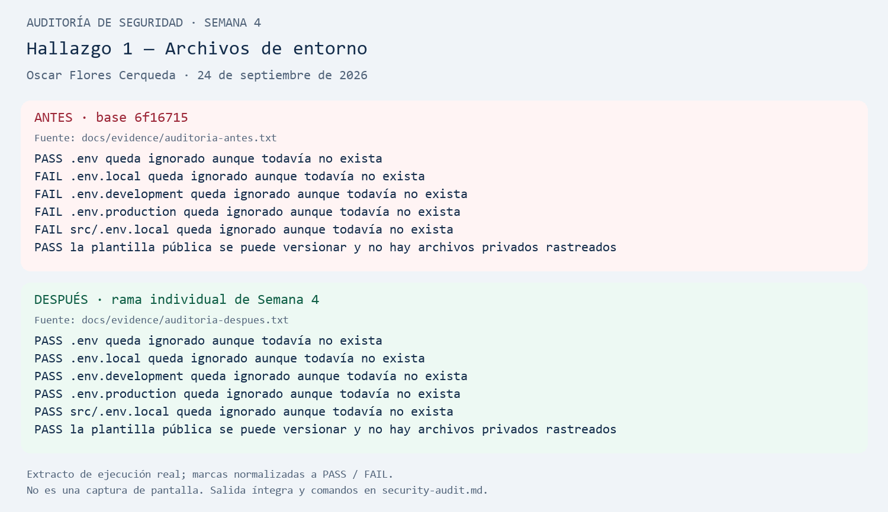
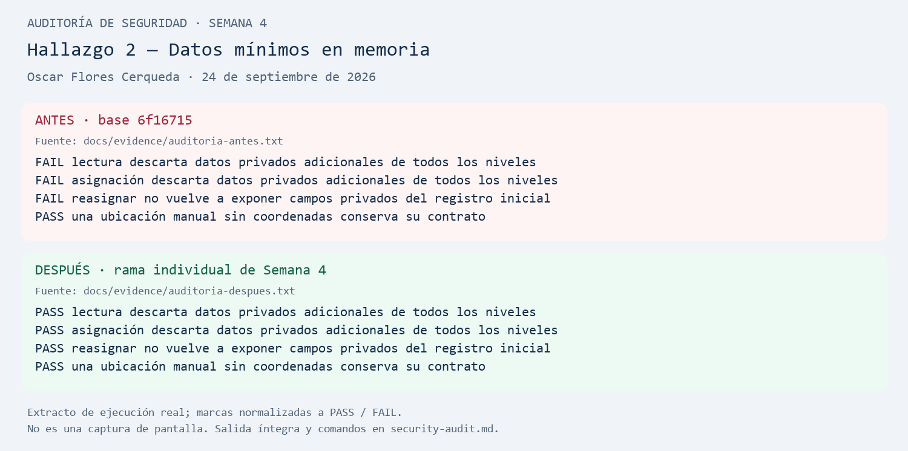
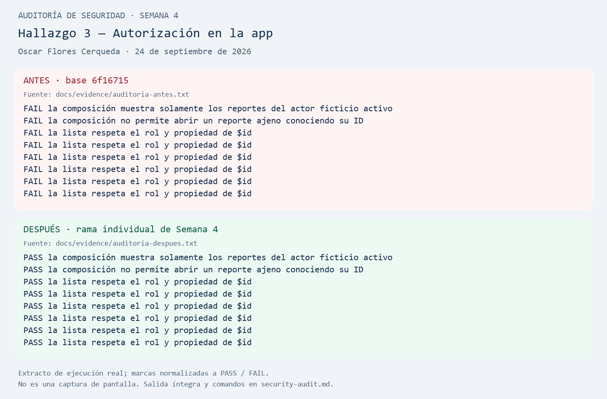

# Auditoría de seguridad — Semana 4

**Nombre:** Oscar Flores Cerqueda

**Equipo:** 4

**Fecha:** 24 de septiembre de 2026

**Repositorio:** https://github.com/Oscar71k1/DMI-Equipo-4

**Rama:** `week4/security-audit-Oscar-Flores-Cerqueda`

**Base revisada:** `origin/main`, commit `6f167155fd203ffffd149d53e1cc34fdf4b1a356`.

Esta es una actividad individual realizada con asistencia de Codex. La rama se creó antes de editar archivos, después de ejecutar `git fetch origin --prune`. La base era la versión remota más reciente del equipo y coincidía con `origin/codex/semana-03-oscar`. Esta rama se conservará separada para la actividad: **no integrar a `main` ni crear una solicitud de integración**.

La auditoría corresponde a la actividad del documento «Actividad Semana 4 — Auditoría de seguridad y privacidad». Los documentos y evidencias históricos del equipo se conservan como antecedentes. No se presentan como resultados nuevos ni se completan los contratos de otras actividades del curso.

## Alcance y método

Se revisaron `.gitignore`, la configuración de ejemplo, los repositorios en memoria, las consultas, la composición de la app, los registros de seguridad y los mensajes de las pantallas. Se identificaron tres problemas del código existente; se agregaron pruebas que fallaron sobre la base y se repitieron después de corregirla.

Todos los datos agregados para reproducir los problemas son ficticios: IDs de demostración, ubicaciones de prueba, correos bajo `example.invalid` y marcadores que no son credenciales válidas. No se encontraron archivos privados `.env` rastreados en la revisión del índice. Esto no equivale a certificar todo el historial ni la ausencia universal de secretos.

## Hallazgos

| # | Hallazgo | Riesgo | Solución aplicada | Evidencia |
|---|---|---|---|---|
| 1 | `.gitignore` solo ignoraba `.env`; variantes como `.env.local` y `.env.production` quedaban fuera. | Una configuración privada podría agregarse accidentalmente al repositorio. | Agregar `.env.*` y conservar la excepción `!.env.example`. | [Antes/después](evidence/gitignore-env.png); [salida completa](evidence/auditoria-despues.txt). |
| 2 | Ambos repositorios en memoria copiaban todos los campos recibidos mediante propagación de objetos. | Propiedades adicionales con datos privados podían conservarse y devolverse en consultas o asignaciones. | Copiar únicamente los campos del contrato, incluidos los objetos `location` y `work`. | [Antes/después](evidence/datos-minimos.png); [pruebas](../tests/security-audit.test.ts). |
| 3 | `createCampusOps` conectaba la UI con consultas sin autorización, aunque existía una política de permisos. | Un actor de la app podía recibir el listado completo y abrir reportes ajenos mediante su ID. | Conectar lista y detalle con consultas autorizadas y un reportante ficticio fijo para esta demostración. | [Antes/después](evidence/consultas-autorizadas.png); [composición corregida](../src/composition/createCampusOps.ts). |

Los tres hallazgos quedaron corregidos dentro del alcance local descrito. No se atribuye al proyecto una filtración real: las pruebas demuestran los comportamientos con información sintética.

## Hallazgo 1 — Archivos de entorno sin exclusión completa

### Problema encontrado

En [`.gitignore`](../.gitignore), la regla `.env` no cubría los nombres `.env.local`, `.env.development`, `.env.production` ni `src/.env.local`. No fue necesario crear ni leer un archivo privado para comprobarlo: `git check-ignore --no-index` evalúa también rutas que todavía no existen.

### Riesgo

Si alguien guardara una contraseña o token en esas variantes, un `git add .` podría incorporarlas. Es un riesgo de publicación accidental, no evidencia de que hubiera una credencial real expuesta.

### Solución

Se ampliaron las reglas y se dejó versionable `.env.example`. La plantilla existente contiene únicamente una URL pública de desarrollo, sin credenciales. Las variables `EXPO_PUBLIC_*` forman parte de la configuración pública del cliente y no deben usarse para esconder secretos.

### Antes

```gitignore
.env
```

### Después

```gitignore
.env
.env.*
!.env.example
```

### Evidencia

Las cuatro variantes fallaban en la prueba inicial; después, las cinco rutas privadas quedaron ignoradas. La plantilla sigue fuera de las exclusiones. Una prueba adicional inspecciona `git ls-files -z` y verifica que no haya archivos `.env` privados rastreados: ignorar un archivo ya versionado no lo elimina del índice.



## Hallazgo 2 — Conservación de campos privados innecesarios

### Problema encontrado

[`InMemoryIncidentRepository.ts`](../src/infrastructure/InMemoryIncidentRepository.ts) y [`InMemoryIncidentAssignmentPort.ts`](../src/infrastructure/InMemoryIncidentAssignmentPort.ts) utilizaban `...incident`, `...incident.location` y `...incident.work`. El tipo TypeScript no elimina propiedades adicionales de un objeto en tiempo de ejecución.

Se pasó a esos repositorios una incidencia ficticia con campos adicionales `email`, `password`, `token`, `location.contactPhone` y `work.technicianEmail`. Antes de corregirlos, esos campos seguían presentes en sus respuestas. También reaparecía un campo privado al reasignar la incidencia.

### Riesgo

Conservar o reenviar esos datos amplía su exposición a cualquier consumidor del repositorio, aunque no sean necesarios para mostrar o asignar la incidencia. Aquí el almacenamiento es en memoria; no se afirma que existiera persistencia en disco ni que la UI mostrara esos campos.

### Solución

Se implementó [`copyIncident.ts`](../src/infrastructure/copyIncident.ts), compartido por ambos repositorios. Solo conserva `id`, `reporterId`, `category`, `description`, `location`, `status` y `work`; en los objetos anidados también selecciona únicamente los campos definidos por el contrato. Se aplica al recibir datos y al devolverlos.

### Antes

```ts
const copyIncident = (incident: Incident): Incident => ({
  ...incident,
  location: { ...incident.location },
  work: { ...incident.work },
});
```

### Después

Fragmento de la selección explícita; el archivo enlazado contiene la implementación completa:

```ts
return {
  id: incident.id,
  reporterId: incident.reporterId,
  category: incident.category,
  description: incident.description,
  location: {
    source: incident.location.source,
    label: incident.location.label,
    ...(incident.location.latitude === undefined ? {} : { latitude: incident.location.latitude }),
    ...(incident.location.longitude === undefined ? {} : { longitude: incident.location.longitude }),
  },
  status: incident.status,
  work: {
    assignedTechnicianId: incident.work.assignedTechnicianId,
    status: incident.work.status,
  },
};
```

### Evidencia

Tres pruebas fallaban antes: ambos repositorios y la reasignación conservaban campos adicionales. Después, las cuatro pruebas del hallazgo pasan: se eliminan los campos ajenos al contrato y se preservan tanto coordenadas sintéticas `(0, 0)` como ubicaciones manuales sin coordenadas. Las regresiones existentes también comprueban que modificar entradas o respuestas no altere el almacén.

La corrección minimiza campos; no detecta información personal escrita dentro de una descripción o etiqueta permitida ni sustituye la validación de datos de una futura API.



## Hallazgo 3 — Consultas de la app sin aplicar los permisos existentes

### Problema encontrado

[`createCampusOps.ts`](../src/composition/createCampusOps.ts), utilizado por `App.tsx`, construía `createIncidentQueries`, que devolvía todas las incidencias y permitía buscar cualquiera por ID. La política `canViewIncident` y las consultas autorizadas existían, pero no estaban conectadas a ese flujo. Además, la versión anterior de las consultas autorizadas solo incluía el detalle, sin listado.

### Riesgo

Los permisos verificados de forma aislada no protegían la ruta usada por la app. En la demostración, el reportante `reporter-1` podía obtener incidencias de `reporter-2` y `reporter-3`. En una futura aplicación con datos personales, esta separación podría exponer descripciones y ubicaciones ajenas.

### Solución

Se añadió `listIncidents(actor)` a [`createAuthorizedIncidentQueries.ts`](../src/application/createAuthorizedIncidentQueries.ts), usando la misma política de permisos que el detalle. La composición enlaza ambas operaciones a un actor fijo y ficticio, `{ id: 'reporter-1', role: 'reporter' }`. Cada decisión del listado se registra mediante el logger que ya limita los campos del evento.

### Antes

```ts
const incidentQueries = createIncidentQueries(incidentRepository);
// Acciones entregadas a la UI:
listIncidents: incidentQueries.listIncidents,
getIncidentDetail: incidentQueries.getIncidentDetail,
```

### Después

```ts
const actor: Actor = { id: 'reporter-1', role: 'reporter' };
const incidentQueries = createAuthorizedIncidentQueries(
  incidentRepository, createInMemorySecurityLogger(),
);
// Acciones entregadas a la UI:
listIncidents: () => incidentQueries.listIncidents(actor),
getIncidentDetail: (id) => incidentQueries.getIncidentDetail(actor, id),
```

### Evidencia

Sobre la base, la composición devolvía las tres incidencias y permitía obtener `inc-002`. Después, devuelve únicamente `inc-001`; tanto un ID ajeno como uno inexistente producen `null`. Se verifican también listas de dos reportantes, un reportante sin registros, dos técnicos y un coordinador, junto con los eventos de autorización. Los seis casos de listado autorizado fallaban inicialmente porque esa operación todavía no existía.

El alcance es una demostración local de autorización. El actor fijo **no es un inicio de sesión** y los permisos del cliente no sustituyen autenticación ni autorización en un servidor. El backend académico y sus credenciales ficticias de contrato no se modificaron.



## Estructura de evidencias — punto 7

```text
docs/
├── security-audit.md
└── evidence/
    ├── gitignore-env.png
    ├── datos-minimos.png
    ├── consultas-autorizadas.png
    ├── auditoria-antes.txt
    ├── auditoria-despues.txt
    ├── regresiones-inicial.txt
    ├── regresiones.txt
    ├── typecheck.txt
    ├── lint.txt
    ├── revision-secretos.txt
    └── revision-git.txt
```

Las tres imágenes representan extractos de resultados reales de Jest. No son capturas de una terminal: el pie de cada imagen lo aclara. Se conservaron también las salidas íntegras, incluidas las diferencias que provocaron los fallos iniciales. El script [`tools/render_security_evidence.py`](../tools/render_security_evidence.py) genera las imágenes desde esos archivos de texto; requiere Python y Pillow.

## Verificación reproducible

Desde la raíz del repositorio, con las dependencias instaladas:

```bash
node node_modules/jest/bin/jest.js --no-watchman --cacheDirectory .jest-cache --ci --runInBand --runTestsByPath tests/security-audit.test.ts
npm run typecheck
npm run lint
node node_modules/jest/bin/jest.js --no-watchman --cacheDirectory .jest-cache --ci --runInBand --runTestsByPath tests/architecture.test.ts tests/incidents.test.tsx tests/security.test.ts tests/security-audit.test.ts course-tests/smoke.test.tsx
python -B tests/secret_scanner_test.py
git check-ignore -v --no-index .env .env.local .env.production src/.env.local
git ls-files -- .env .env.local .env.production .env.example
git status --short
```

En esta sesión se usaron Node.js `v24.21.0` y npm `11.19.0`. La ejecución inicial de las mismas 18 pruebas sobre el código base produjo **15 fallos y 3 aciertos**, código de salida `1`. La ejecución corregida produjo **18 pruebas aprobadas**, código `0`. Los comandos de comprobación y sus códigos de salida se conservan en los archivos de evidencia.

| Comprobación final | Resultado | Salida |
|---|---|---|
| Auditoría individual | 18/18 pruebas aprobadas | [auditoria-despues.txt](evidence/auditoria-despues.txt) |
| Arquitectura, UI, seguridad, auditoría y arranque | 45/45 pruebas aprobadas, 5 suites | [regresiones.txt](evidence/regresiones.txt) |
| TypeScript | Código 0 | [typecheck.txt](evidence/typecheck.txt) |
| ESLint | Código 0 | [lint.txt](evidence/lint.txt) |
| Controles del detector de secretos | 3/3 pruebas aprobadas | [revision-secretos.txt](evidence/revision-secretos.txt) |
| Escaneo con los patrones del curso | Lista vacía de detecciones, código 0 | [revision-secretos.txt](evidence/revision-secretos.txt) |
| Índice y reglas Git | Sin archivos privados de entorno en la entrega | [revision-git.txt](evidence/revision-git.txt) |

La [primera ejecución de regresiones](evidence/regresiones-inicial.txt) registró 43 aciertos y 2 fallos: un tiempo de espera de 5 segundos agotado en una prueba de interfaz y un diagrama desactualizado respecto de los nuevos imports. Se actualizó `docs/architecture.mmd` y se repitió el comando sin ejecutar simultáneamente TypeScript y ESLint. Las 45 pruebas pasaron sin modificar las pruebas previas ni sus límites de tiempo. Esa repetición no identifica por sí sola la causa del agotamiento de tiempo inicial.

El escaneo del repositorio se ejecutó con el detector existente, sin cambiar sus patrones ni exclusiones:

```bash
python -B -c "import runpy; from pathlib import Path; scanner = runpy.run_path('tools/course_public_evaluator.py'); hits = scanner['scan_secrets'](Path('.')); print('Archivos detectados por el escaner del curso:'); print(hits); raise SystemExit(bool(hits))"
```

Este detector reconoce solo los patrones definidos por el curso; su resultado se complementó con la revisión del diff y de los datos ficticios de las evidencias. No se modificaron dependencias ni el backend, y no se declara una compilación nativa ni una auditoría completa de dependencias para esta actividad.

Para volver a comprobar el estado anterior, se puede crear una copia temporal del commit base y llevar allí únicamente `tests/security-audit.test.ts`; no se debe revertir la rama de entrega. `auditoria-antes.txt` se obtuvo antes de editar las implementaciones y `.gitignore`.

## Comprobación final y entrega

- Tres hallazgos relacionados con el código existente, documentados con problema, riesgo, corrección y evidencia.
- Tres correcciones implementadas y verificadas con casos positivos y negativos.
- Evidencias bajo `docs/evidence`, con nombres descriptivos.
- `.env.example` pública; archivos de entorno privados fuera del índice.
- Revisión de los archivos de la entrega sin incorporar los reportes locales preexistentes `reports/week-02/failure.json` y `reports/week-03/failure.json`.
- Rama individual separada, sin integración a `main`.

Para Classroom, usar el nombre **Oscar Flores Cerqueda**, la URL del repositorio y la rama indicada al principio. El grupo no consta en los archivos revisados y debe completarse al entregar. Después del commit final, obtener su identificador con `git log -1 --oneline`; no se escribe el SHA del propio commit dentro del documento para evitar una referencia circular.
